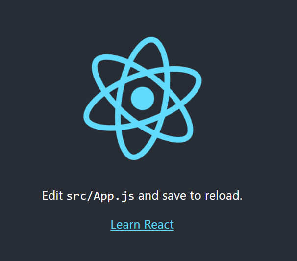

작업환경 준비

## 해당 교재에서 리액트를 배우는데 준비할 사항
> - Node.js : Webpack(여러가지 파일을 한개로 결합), Babel(JSX를 비롯한 새로운 자바스크립트 문법 사용을 위함) 등을 사용 위함
> - Yarn : 패키지 매니저 도구(npm보다 빠르다고 칭찬이 자자)
> - 코드 에디터 : 난 VSCode
> - Git bash : Windows 기반에서 패키지 설치나 yarn 명령어 등 사용하려고 사용하는 듯?

## 그대로 따라했더니 나오는 화면
> 
> ※ yarn start 종료하려면 ctrl+C

## VS Code 에서 터미널 띄우기
> 난 해도 안됨.. 파워쉘로 실행되던데.. 일단 넘어감